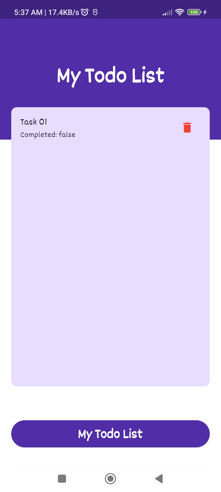
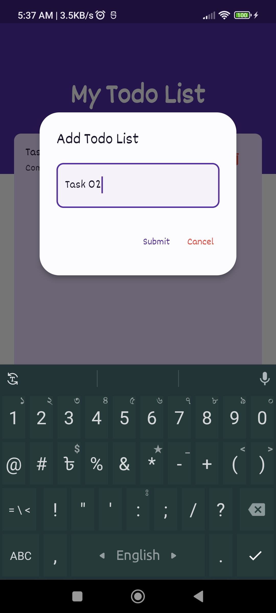
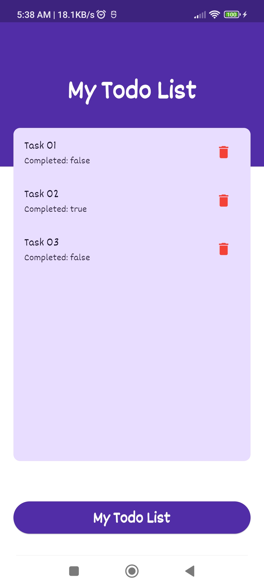
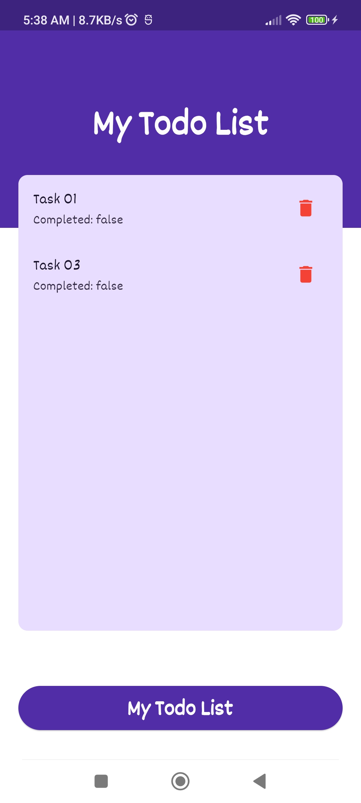

# Todo List App

A simple Todo List app built with Flutter using the Riverpod state management library and SharedPreferences for data persistence.

## Features

- Add new tasks to the todo list.
- Mark tasks as completed or incomplete.
- Remove tasks from the todo list.
- Persistent storage of tasks using SharedPreferences.
- Responsive design for various screen sizes.

## Screenshots








## Getting Started

These instructions will help you get a copy of the project up and running on your local machine for development and testing purposes.

### Prerequisites

- Flutter installed on your machine ([Flutter Installation Guide](https://flutter.dev/docs/get-started/install))

### Clone the Repository

```bash
git clone https://github.com/your-username/todo-list-app.git
cd todo-list-app


 **Happy Learning and Todo-ing! **